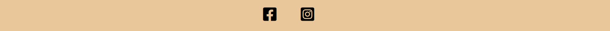

[used this to pick color from hero image](https://imagecolorpicker.com/)

# Rydbergs Ateljé
Rydbergs Ateljé is a website that provides information about the person behind the sewing- and design- studio called Rydbergs Ateljé. The website helps the owner and the potential costumers to comunicate. It shows the costumers what kind of help you can expect in Rydbergs Ateljé and how to get in touch with the owner. It also helps the owner to show off her work and reach out to new costumers

## Features

### Navigation Bar
<ul>
    <li>You will find the navigationbar with three links at the right top of the page. Theese helps the user to navigate faster down the page in those cases where they only need some specific information. The links turn light grey when you hover over them to show the user that "this is a link".</li>
</ul>

### Welcome section
<ul>
    <li>The first section the user meets while entering the site is designed to present a clear picture of where they have come and what they will find here. They will see a picture of the person behind the work they are interested in and some short and easy information about what skills she have. The colors, pictureas and design will give the visitor a feeling of what kind of design and style her work goes in line with.</li>
</ul>

### About section
<ul>
    <li>The second section is easy to acces with the navigation bar but also possible to scroll down to. Here is a more descriptive information about the skills and experience the owner of Rydbergs Atleljé has. It gives information about what kind of service she offers and what you can expect from her work.</li>
    <li>The previous collaborations part shows some customers she has worked for earlier to give the user a deeper understanding of her skills and experiences.</li>
</ul>

### Gallery
<ul>
    <li>The third section provides more information about the owners work but this time in images. The images, again, gives the visitor a feeling of style and design but also what kind of clothings she has done and usually do.
This section is also possible to reach using the navigation bar.</li>
</ul>

### Contact
<ul>
    <li>The forth section provides information about where or how to get in touch with Rydbergs Ateljé. It shows the adress and a map to where the studio is located. If you click on the map it will open up in google maps where the user easier can understand where and how to find the studio.</li>
    <li>Here you can also find a simple form where the user can fill in contact information and a short message to reach out to the owner in an easy way.</li>
</ul>

### Footer
<ul>
    <li>The footer is really small but handy because it provides links for socialmedia for those who are even more interested in getting to know the owner of Rydbergs Ateljé. For marketing, this is perhaps the most important links the owner wants the customer to find, because of that the position of this is fixed so it is easy to find regardless on where you are on the website.</li>
</ul>

### Extra features for future developement
<ul>
    <li>A copy of the whole page but with all swedish text, two links in the header with to navigate between the two languages</li>
    <li>Make all the list items beneath "Previous collaborations" also work as links to the websites of theese companys, this will help the user understand more about the work they do if they dont recognise the company by the name</li>
    <li>Give the navigation bar a fixed position and add a "home" link. This will give the user access to navigate through the page even when they already scrolled down a bit.</li>
    <li>Make social media links bigger or at least with bigger space between eachother so it is easier to klick on mobile phone where you use you fingers instead of mouse.</li>
</ul>

## Testing
<ul>
    <li>The links in the navigation bar works well, brings me down to the section with the same name.</li>
    <li>Social media links takes me to the right pages and opens up in a new tab (Though the company that the website presents dont have any social media right now it only leads to Instagram and Facebooks homepage, this is easy to change when the company has its own socialmedia to link to)</li>
    <li>The form works well, the "Phonenumber" field doesent approve letters and the "Email" field doesent approve content without @ in it. When you click the submit button it will take you to an error site, this is because the "action" attribute is not linked to anything yet.</li>
    <li>The map in the contact section brings you to google maps and opens up in a new tab</li>
    <li>The website changes its layout when you make the screen bigger or smaller. It is tested and looks good on all screenwidths between 1920px and 250px.</li>
    
</ul>

## Validator Testing

## Unfixed bugs

# Deployment

### The site was deployed to GitHub pages. The steps to deploy are as follows:
<ul>
<li>In the GitHub repository, navigate to the Settings tab</li>
<li>From the source section drop-down menu, select the Master Branch</li>
<li>Once the master branch has been selected, the page will be automatically refreshed with a detailed ribbon display to indicate the successful deployment.</li>

<li>The live link can be found here - https://code-institute-org.github.io/love-running-2.0/index.html</li>
</ul>

# Credits
<ul>
<li>This page gave me some usefull code https://www.w3schools.com</li>
</ul>
## Media

## Content
<ul>
<li>Used this to pick color from hero image: https://imagecolorpicker.com/</li>
<li>Google fonts</li>
<li>font awesome for footer links</li>
<li>spencers links to pictures</li>
<li>name of the photographer of my own photos? or just "Jessica Rydbergs private photos"</li>

<li>Find out a way to remove classes when screens a smaller, then I can give h1 and nav class "left" and "right"</li>
</ul>