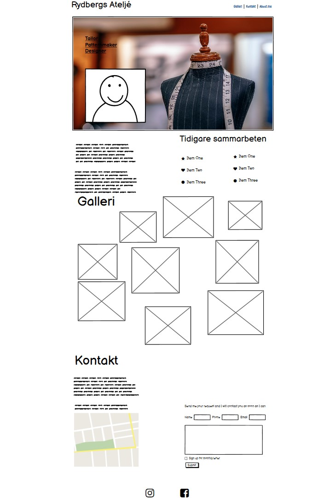

# Rydbergs Ateljé
Rydbergs Ateljé is a website that provides information about the person behind the sewing- and design- studio called Rydbergs Ateljé. The website helps the owner and the potential costumers to comunicate. It shows the costumers what kind of help you can expect in Rydbergs Ateljé and how to get in touch with the owner. It also helps the owner to show off her work and reach out to new costumers

## Wireframe
This was my design idea from the beginning:
 

## Features

### Navigation Bar
<ul>
    <li>You will find the navigationbar with four links at the right top of the page. Theese helps the user to navigate faster down the page in those cases where they only need some specific information. The links turn brown when you hover over them to show the user that "this is a link".</li>
    <li>The navigation bar has a fixed position which gives the user easy access to it regardless on where you are at the page</li>
</ul>

### Home section
<ul>
    <li>The first section is designed to present a clear picture of where they have come and what they will find here. First the logo telling the user what company this website is about. Then they will see a picture of the person behind the company and some short and easy information about what skills she have. The colors, pictures and design will give the visitor a feeling of what kind of design and style her work goes in line with.</li>
</ul>

### About section
<ul>
    <li>The second section is easy to acces with the navigation bar but also possible to scroll down to. Here is a more descriptive information about the skills and experience the owner of Rydbergs Atleljé has. It gives information about what kind of service she offers and what you can expect from her work.</li>
    <li>The previous collaborations part shows some customers she has worked for earlier to give the user a deeper understanding of her skills and experiences.</li>
</ul>

### Gallery
<ul>
    <li>The third section provides more information about the owners work but this time in images. The images, again, gives the visitor a feeling of style and design but also what kind of clothings she has done and usually do.
This section is also possible to reach using the navigation bar.</li>
</ul>

### Contact
<ul>
    <li>The forth section provides information about where or how to get in touch with Rydbergs Ateljé. It shows the adress and a map to where the studio is located. If you click on the map it will open up in google maps where the user easier can understand where and how to find the studio.</li>
    <li>Here you can also find a simple form where the user can fill in contact information and a short message to reach out to the owner in an easy way</li>
</ul>

### Footer
<ul>
    <li>The footer contains two social media links. They are a bit bigger and has some space between them also on the smallest srean to make it easier to click them with a finger on a mobile phone</li>
</ul>

### Extra features for future developement
<ul>
    <li>Make all the list items beneath "Previous collaborations" also work as links to the websites of theese companys, this will help the user understand more about the work they do if they dont recognise the company by the name</li>
</ul>

## Testing
<ul>
    <li>The links in the navigation bar works well, brings me down to the section with the same name.</li>
    <li>Social media links takes me to the right pages and opens up in a new tab (Though the company that the website presents dont have any social media right now it only leads to Instagram and Facebooks homepage, this is easy to change when the company has its own socialmedia to link to)</li>
    <li>The form works well, the "Phonenumber" field doesent approve letters and the "Email" field doesent approve content without @ in it. When you click the submit button it will take you to an error site, this is because the "action" attribute is not linked to anything yet.</li>
    <li>The map in the contact section brings you to google maps and opens up in a new tab</li>
    <li>The website changes its layout when you make the screen bigger or smaller. It is tested and looks good on all screenwidths between 1920px and 250px.</li>
    
</ul>

## Validator Testing
### HTML
<ul>
    <li>No errors found when passing through W3C validator: https://validator.w3.org/nu/?doc=https%3A%2F%2Fjessicarydberg.github.io%2FRydbergs_Atelje%2F</li>
</ul>

### CSS
<ul>
    <li>No errors found when passing through (Jigsaw) validator: https://jigsaw.w3.org/css-validator/validator?uri=https%3A%2F%2Fjessicarydberg.github.io%2FRydbergs_Atelje%2F&profile=css3svg&usermedium=all&warning=1&vextwarning=&lang=en/</li>    
</ul>

## Unfixed bugs
<ul>
    <li>No bugs discovered</li>
</ul>

# Deployment

### The site was deployed to GitHub pages. The steps to deploy are as follows:
<ul>
    <li>A local git was used by first initialising with command git init.</li>
    <li>Then at regular intervals i used command git add filename to add the various files into it.</li>
    <li>then i committed to local repo with command git commit -m "useful string info"</li>
    <li>and then finally uploaded it to my GitHub repo with git push</li>
    <li>When everything was done I navigated to the Settings tab in the GitHub repository.</li>
    <li>Then scrolled down to "GitHub Pages" section and clicked "Check it out here!" link</li>
    <li>Once the master branch has been selected, the page will be automatically refreshed with a detailed ribbon display to indicate the successful deployment.</li>
    <li>The live link can be found here: https://jessicarydberg.github.io/Rydbergs_Atelje/</li>
</ul>

# Credits
<ul>
<li>https://www.w3schools.com helped me some usefull elements.</li>
</ul>

## Content
<ul>
    <li>https://imagecolorpicker.com/ was used for picking a color from the hero image and use it as background color for the footer.</li>
    <li>The font styles are imported from https://fonts.google.com/</li>
    <li>The icons for social media links are were taken from https://fontawesome.com/</a></li>
    <li>The mockup presented in the readme file was made using http://techsini.com/multi-mockup/index.php/</li>
</ul>

## Media
<ul>
    <li>The hero image and some images in the gallery was picked from https://unsplash.com/. All the other pictures are my private photographes</li>
</ul>